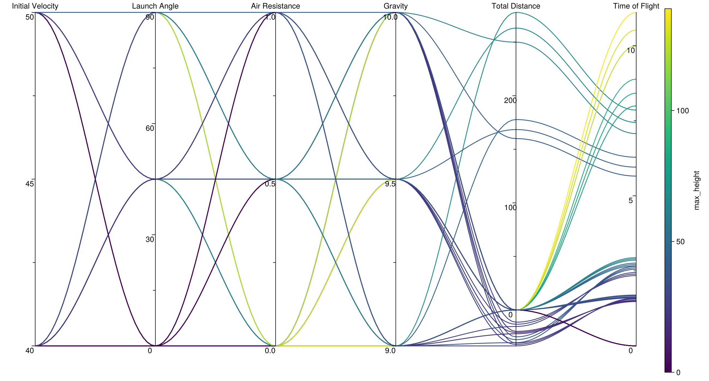

# ParallelPlots

[](https://moritz155.github.io/ParallelPlots/stable/)
[](https://moritz155.github.io/ParallelPlots/dev/)
[](https://github.com/moritz155/ParallelPlots/actions/workflows/CI.yml?query=branch%3Amain)
[](https://codecov.io/gh/moritz155/ParallelPlots)

## General
This Project is for the TU-Berlin Course "Julia Programming for Machine Learning"<br>
Please make sure, that Julia `1.10` is used!

This Module will return you a nice Makie Plot you can use to display your Data with [Parallel Coordinates](https://en.wikipedia.org/wiki/Parallel_coordinates)<br>


## Getting Started

### Install Dependencies & Use ParallelPlots
#### Script/REPL
`Pkg> add https://github.com/moritz155/ParallelPlots`
#### Notebook
```
using Pkg
Pkg.add(url="https://github.com/moritz155/ParallelPlots")
using ParallelPlots
```
### Usage
#### Available Parameter

| Parameter         | Default  | Example                            | Description                                                                                                                |
|-------------------|----------|------------------------------------|----------------------------------------------------------------------------------------------------------------------------|
| title::String     | ""       | title="My Title"                   | The Title of The Figure,                                                                                                   |
| colormap          | :viridis | colormap=:thermal                  | The Colors of the [Lines](https://docs.makie.org/dev/explanations/colors)                                                  |
| color_feature     | nothing  | color_feature="weight"             | The Color of the Lines will be based on the values of this selected feature. If nothing, the last feature will be used     |
| feature_labels    | nothing  | feature_labels=["Weight","Age"]    | Add your own Axis labels, just use the exact amount of labes as you have axis                                              |
| feature_selection | nothing  | feature_selection=["weight","age"] | Select, which features should be Displayed. If color_feature is not in this List, use the last one                         |
| curve             | false    | curve=true                         | Show the Lines Curved                                                                                                      |
| show_color_legend | nothing  | show_color_legend=true             | Show the Color Legend. If parameter not set & color_feature not shown, it will be displayed automaticly                    |
| scale             | nothing  | scale=[log2, identity, log10]      | Choose, how each Axis should be scaled. In the Example. The first Axis will be log2, the second linear and the third log10 |


#### Examples
```
julia> using ParallelPlots
julia> parallelplot(DataFrame(height=160:180,weight=60:80,age=20:40))
```
```
# If you want to set the size of the plot (default width:800, height:600)
julia> parallelplot( DataFrame(height=160:180,weight=60:80,age=20:40), figure = (resolution = (300, 300),) )
```
```
# You can update as well the Graph with Observables
julia> df_observable = Observable(DataFrame(height=160:180,weight=60:80,age=20:40))
julia> fig, ax, sc = parallelplot(df_observable)
```
```
# If you want to add a Title for the Figure, sure you can!
julia> parallelplot(DataFrame(height=160:180,weight=reverse(60:80),age=20:40),title="My Title")
```
```
# If you want to specify the axis labels, make sure to use the same number of labels as you have axis!
julia> parallelplot(DataFrame(height=160:180,weight=reverse(60:80),age=20:40), feature_labels=["Height","Weight","Age"])
```
```
# Adjust Color and and feature
parallelplot(df,
        # You choose which axis/feature should be in charge for the coloring
        color_feature="weight",
        # you can as well select, which Axis should be shown
        feature_selection=["height","age","income"],
        # and label them as you like
        feature_labels=["Height","Age","Income"],
        # you can change the ColorMap (https://docs.makie.org/dev/explanations/colors)
        colormap=:thermal,
        # ...and can choose to display the color legend.
        # If this Attribute is not set,
        # it will only show the ColorBar, when the color feature is not in the selected feature
        show_color_legend = true
    )
```
```
# Adjust the Axis scale
parallelplot(df,
        feature_selection=["height","age","income"],
        scale=[log2, identity, log10]
    )
```

### Working on ParallelPlots / Cheatsheet
1. Using ParallelPlots
    * Moving to the  project folder
    * `julia --project`
      * You will see `julia>`
    * To move to the pkg, type in `]`


2. Running commands
   * Adding external Dependencies
     - `(ParallelPlots) pkg>add 'DepName'`
   * Run Tests to check if ParallelPlots is still working as intended 
     - `(ParallelPlots) pkg>test`
   * Build
     - `(ParallelPlots) pkg>build`
   * Precompile
     - `(ParallelPlots) pkg>precompile`


#### Create Docs
* move to `./docs` folder with command line
* run `julia --project make.jl`


