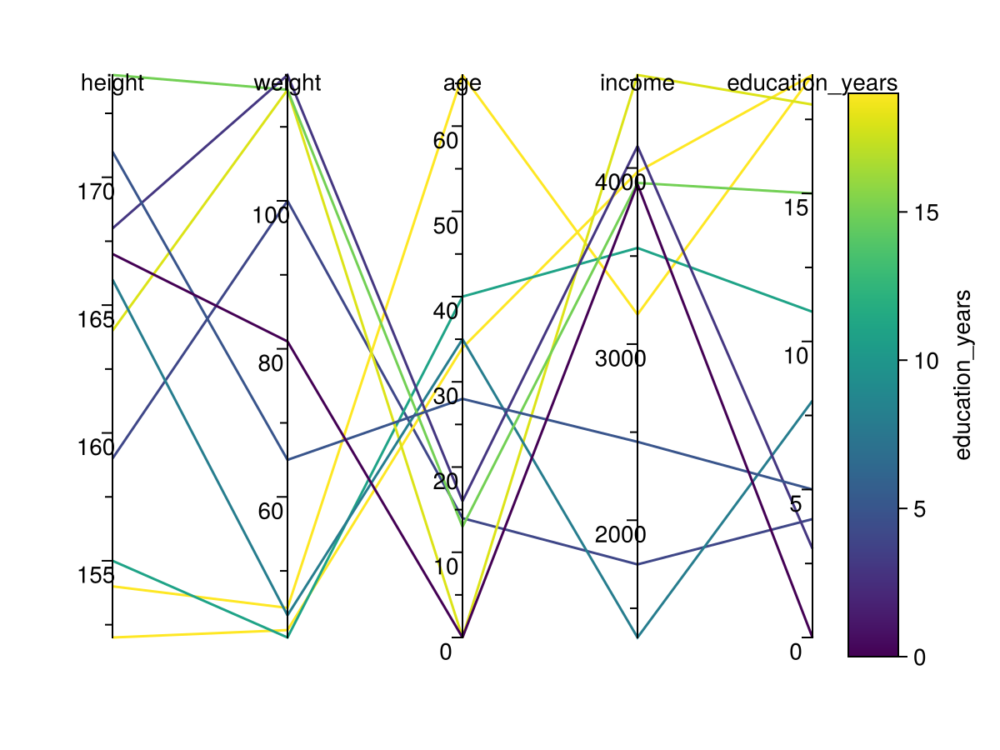

# ParallelPlots

[](https://moritz155.github.io/ParallelPlots.jl/stable/)
[](https://moritz155.github.io/ParallelPlots.jl/dev/)
[](https://github.com/moritz155/ParallelPlots/actions/workflows/CI.yml?query=branch%3Amain)
[](https://codecov.io/gh/moritz155/ParallelPlots.jl)

## General
This Project is for the TU-Berlin Course "Julia Programming for Machine Learning"<br>
Please make sure, that Julia `1.10` is used!

This Module will return you a nice Scene you can use to display your Data with [Parallel Coordinates](https://en.wikipedia.org/wiki/Parallel_coordinates)<br>


_This Module was created with PkgTemplates.jl_

## Getting Started

### Install Dependencies & Use Package
Please refer to this [Link](https://adrianhill.de/julia-ml-course/lectures/E1_Installation.html) for Installation of Julia

You need to use the package (1-3) and install the dependencies (4-5)
1. Open Julia with `julia` in your command prompt
2. Open the package manager with `]`
3. Using our Package
    * `activate /path/to/package` <br>
      or<br>
      `activate .` when Julia was opened with command prompt already in package path

    * _you will then see: `(ParallelPlots) pkg>`_
4. go back to `julia>` by pressing `CMD`+`C`
5. `Import ParallelPlots` to download Dependencies and use the Package from Command Line

### Usage
```@example
julia> using ParallelPlots
julia> parallelplot(DataFrame(height=160:180,weight=60:80,age=20:40))
```
```
# If you want to normalize the Data, you can add the value normalized=true, default is false
julia> parallelplot(DataFrame(height=160:180,weight=reverse(60:80),age=20:40),normalize=true)
```
```
# If you want to set the size of the plot (default width:800, height:600)
julia> parallelplot( DataFrame(height=160:180,weight=60:80,age=20:40), figure = (resolution = (300, 300),) )
```
```
# You can update as well the Graph with Observables

julia> df_observable = Observable(DataFrame(height=160:180,weight=60:80,age=20:40))
julia> fig, ax, sc = parallelplot(df_observable)
```
```
# If you want to add a Title for the Figure, sure you can!
julia> parallelplot(DataFrame(height=160:180,weight=reverse(60:80),age=20:40),title="My Title")
```
```
# If you want to specify the axis labels, make sure to use the same number of labels as you have axis!
julia> parallelplot(DataFrame(height=160:180,weight=reverse(60:80),age=20:40), ax_label=["Height","Weight","Age"])
```

Please read the [Docs](/docs/build/index.html) for further Information

### Working on this Package / Cheatsheet
1. Using the Package
   * `activate /path/to/package` <br>
   or<br>
   `activate .` when Julia was opened with command prompt already in package path
 
   * _you will then see: `(ParallelPlots) pkg>`_

2. Running commands
   * Adding external Dependencies
     - `add DepName`
   * Run Tests to check if Package is still working as intended 
     - `test`
   * Build
     - `build`
   * Precompile
     - `precompile`


#### Create Docs
* move to `./docs` folder with command line
* run `julia --project make.jl`


